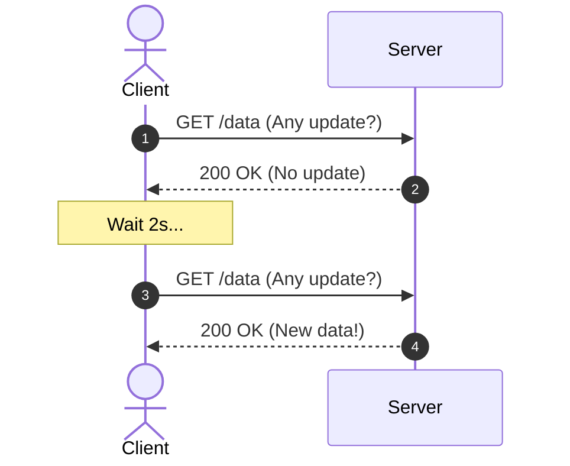
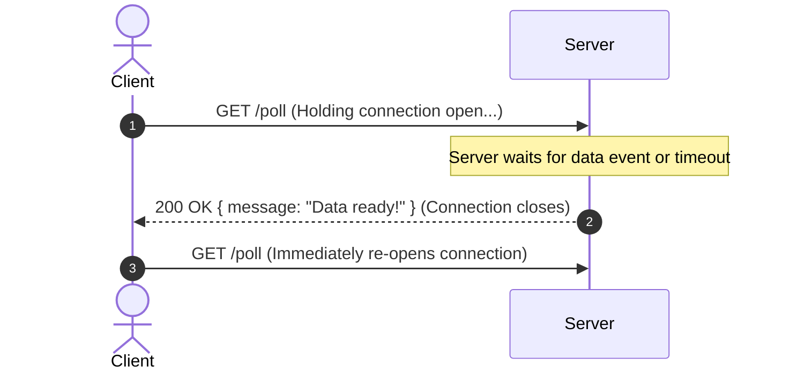
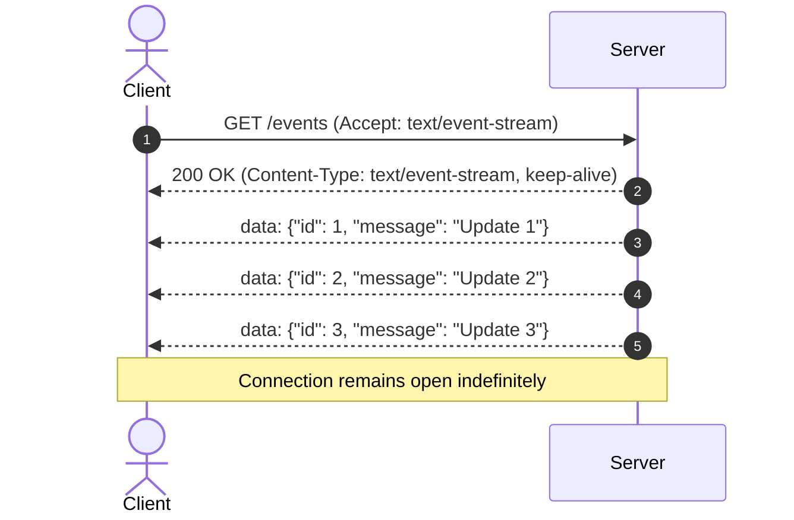
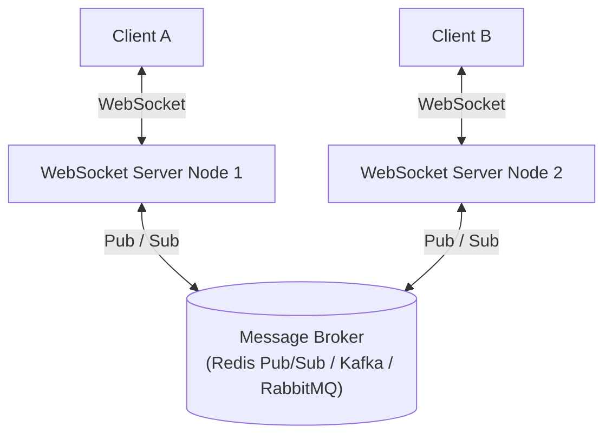
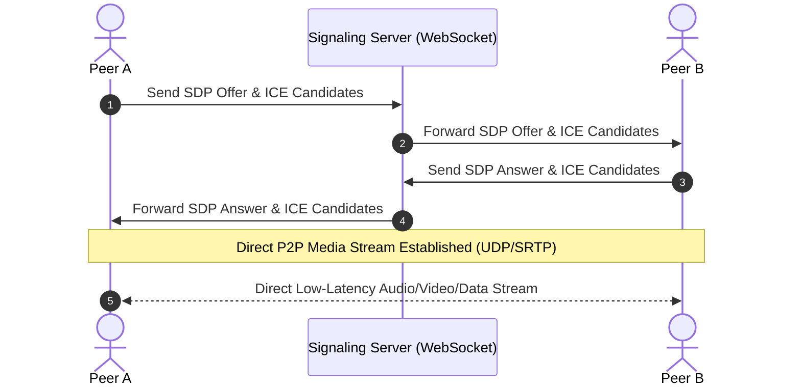

# ⚡ Real-Time Communication & WebRTC Master Reference

[](https://nodejs.org/)
[](LICENSE)
[](https://youtu.be/_CCyMWSZNU4)

A hands-on learning repository and reference guide covering the core **Real-Time Communication (RTC)** paradigms in modern software engineering: **Short Polling**, **Long Polling**, **Server-Sent Events (SSE)**, **WebSockets**, and **WebRTC**.

Inspired by and built following the tutorial by **Hitesh Choudhary** on [*Chai aur Code*](https://www.youtube.com/@chaiaurcode):  
🎬 **[Long polling, server sent Events and Web Sockets | Real time communication jargons in Hindi](https://youtu.be/_CCyMWSZNU4)**.

---

## 📑 Table of Contents

- [The Core Problem & Real-World Use Cases](#-the-core-problem--real-world-use-cases)
- [Communication Paradigms Explained](#-communication-paradigms-explained)
  - [1. Short Polling](#1-short-polling)
  - [2. Long Polling & Universal Compatibility](#2-long-polling--universal-compatibility)
  - [3. Server-Sent Events (SSE)](#3-server-sent-events-sse)
  - [4. WebSockets & Scaling with Message Brokers (Redis / Kafka)](#4-websockets--scaling-with-message-brokers-redis--kafka)
  - [5. WebRTC](#5-webrtc)
- [Master Comparison Matrix](#-master-comparison-matrix)
- [Repository Structure](#-repository-structure)
- [Getting Started & How to Run](#-getting-started--how-to-run)
  - [Running Long Polling](#running-long-polling)
  - [Running Server-Sent Events (SSE)](#running-server-sent-events-sse)
  - [Running WebSockets](#running-websockets)
  - [Interactive Browser Playground](#interactive-browser-playground)
- [Detailed Study Notes](#-detailed-study-notes)
- [Credits & Acknowledgements](#-credits--acknowledgements)

---

## ❓ The Core Problem & Real-World Use Cases

Traditional HTTP is **stateless and half-duplex** (Client Pull only). The client issues a request, the server responds, and the connection closes.

```
Client ──[ HTTP Request ]──▶ Server ──[ HTTP Response ]──▶ (Connection Closes)
```

While beginners often think real-time communication is purely for **Chat Applications**, in the software industry, the dominant use case is **Real-Time Dashboards & Analytics**:
- **SaaS Metric Monitoring:** Live visitor counters, telemetry, error tracking.
- **Financial & Crypto Exchanges:** Live order books, price updates, candle charts.
- **Competitive Programming (LeetCode):** Real-time submission evaluation statuses.
- **Log Streaming & LLM Generation:** Live CI/CD terminal output, ChatGPT token streams.

---

## 🧠 Communication Paradigms Explained

### 1. Short Polling
- **How it works:** The client repeatedly queries the server at fixed intervals (e.g. every 2 seconds).
- **Mental Model:** A child asking *"Are we there yet?"* continuously.
- **Drawback:** Massive bandwidth & CPU wastage due to repeated TCP/TLS handshakes and HTTP headers when no new data has changed.



---

### 2. Long Polling & Universal Compatibility
- **File:** [`longPolling.js`](./longPolling.js)
- **How it works:** The client requests `/poll`. The server **holds the connection open** (hanging request) until data arrives or a timeout occurs. Once sent, the client immediately fires a new request.
- **Why Long Polling is Still Extensively Used:**
  - **Universal Compatibility:** Works on every browser, legacy device, and network.
  - **Corporate Proxies & Firewalls:** Many enterprise networks block or strip non-HTTP protocols (like WebSocket upgrade headers). Long Polling runs on plain HTTP/REST, making it a reliable fallback.
- **Drawbacks:** Server memory pressure when holding thousands of concurrent connections; repeated HTTP header overhead upon reconnection.



---

### 3. Server-Sent Events (SSE)
- **File:** [`serverSentEvents.js`](./serverSentEvents.js)
- **How it works:** The client establishes a single continuous HTTP stream (`text/event-stream`). The server pushes updates down the stream as formatted chunks (`data: ...\n\n`).
- **Direction:** **Unidirectional** (Server $\rightarrow$ Client).
- **Key Headers Required:**
  1. `Content-Type: text/event-stream`
  2. `Cache-Control: no-cache`
  3. `Connection: keep-alive`
- **Strengths:** Native browser auto-reconnect (`EventSource`), low memory overhead, works seamlessly across HTTP/1.1 and HTTP/2. Ideal for streaming AI/LLM tokens.



---

### 4. WebSockets & Scaling with Message Brokers (Redis / Kafka)
- **File:** [`webSocket.js`](./webSocket.js)
- **How it works:** Begins with an HTTP handshake (`Upgrade: websocket`) that switches protocols to a **full-duplex TCP socket** (`ws://` or `wss://`).
- **Direction:** **Bidirectional** (Client $\longleftrightarrow$ Server).

#### The WebSocket Scaling Problem & Message Brokers
Because WebSockets maintain **stateful, persistent TCP connections** tied to a single server instance, direct multi-server scaling requires a broker:



- If **Client A** is on Node 1 and **Client B** is on Node 2, Node 1 publishes the message to **Redis Pub/Sub** or **Kafka**.
- The broker broadcasts the message across all server nodes so Node 2 delivers it to Client B.

---

### 5. WebRTC (Web Real-Time Communication)
- **How it works:** Browser standard for direct **Peer-to-Peer (P2P)** high-throughput, low-latency audio, video, and binary data streaming over UDP.
- **Role of Signaling:** Uses an external WebSocket/HTTP server only to exchange network metadata (ICE candidates) and session profiles (SDP offers/answers). Once established, media flows directly between peers.



---

## 📊 Master Comparison Matrix

| Feature / Metric | Short Polling | Long Polling | Server-Sent Events (SSE) | WebSockets | WebRTC |
| :--- | :--- | :--- | :--- | :--- | :--- |
| **Direction** | Client $\rightarrow$ Server | Server $\rightarrow$ Client | Server $\rightarrow$ Client (1-Way) | Bidirectional (2-Way) | Peer-to-Peer (P2P) |
| **Protocol** | HTTP / 1.1 | HTTP / 1.1 | HTTP / 1.1 or HTTP/2 | WS / WSS (RFC 6455) | UDP (SRTP / SCTP) |
| **Connection State** | Stateless | Stateful hold in memory | Persistent HTTP stream | Persistent TCP socket | Direct P2P stream |
| **Proxy / Firewall** | 100% Compatible | 100% Compatible | High compatibility | Can be blocked by proxies | Needs STUN/TURN |
| **Scaling Strategy** | Standard load balancer | Sticky sessions / DB poll | Standard load balancer | **Requires Redis / Kafka Broker** | Signaling + Media Relays |
| **Best Used For** | Infrequent checks | Universal fallback | Live feeds, AI token streaming | Chat, Multiplayer, Live sync | Video/Audio calls, P2P file share |

---

## 📁 Repository Structure

```
.
├── longPolling.js            # Node.js Long Polling HTTP server implementation
├── serverSentEvents.js       # Node.js Server-Sent Events (SSE) server implementation
├── webSocket.js              # Node.js WebSocket server implementation (ws)
├── public/
│   └── index.html            # Interactive visual testing playground for all 3 protocols
├── notes/
│   ├── Chai_aur_Code_RTC_Notes.md  # In-depth architectural notes from the video
│   └── subtitles.srt         # Complete video subtitles reference
├── package.json              # Project scripts and dependencies
└── README.md                 # Master documentation & reference guide
```

---

## 🚀 Getting Started & How to Run

### Prerequisites
Make sure you have [Node.js](https://nodejs.org/) installed (v16 or higher recommended).

```bash
# Clone the repository
git clone https://github.com/iamakashtechie/WebRTC-Learning.git

# Navigate into project directory
cd "Real Time Communication WebRTC"

# Install dependencies (ws library)
npm install
```

---

### Running Long Polling

```bash
npm run poll
# or: node longPolling.js
```

**Testing with `curl`:**
```bash
curl http://localhost:3000/poll
```

**Testing in Browser Console:**
```javascript
async function startLongPolling() {
  while (true) {
    try {
      const res = await fetch('http://localhost:3000/poll');
      const data = await res.json();
      console.log('Received:', data);
    } catch (e) {
      console.error('Polling error:', e);
      await new Promise(r => setTimeout(r, 2000));
    }
  }
}
startLongPolling();
```

---

### Running Server-Sent Events (SSE)

```bash
npm run sse
# or: node serverSentEvents.js
```

**Testing with `curl`:**
```bash
curl -N http://localhost:3000/events
```

**Testing in Browser Console:**
```javascript
const eventSource = new EventSource('http://localhost:3000/events');
eventSource.onmessage = (event) => {
  console.log('SSE Event:', JSON.parse(event.data));
};
```

---

### Running WebSockets

```bash
npm run ws
# or: node webSocket.js
```

**Testing in Browser Console:**
```javascript
const ws = new WebSocket('ws://localhost:3000');
ws.onopen = () => ws.send('Hello from browser!');
ws.onmessage = (event) => console.log('WebSocket Received:', event.data);
```

---

### Interactive Browser Playground

Open [`public/index.html`](./public/index.html) directly in any web browser to test all three protocols with a live interactive log interface!

---

## 📝 Detailed Study Notes

- 📖 [Chai aur Code RTC Master Notes](./notes/Chai_aur_Code_RTC_Notes.md)
- 🎬 [Video Subtitles Reference](./notes/subtitles.srt)

---

## 🤝 Credits & Acknowledgements

Special thanks to **Hitesh Choudhary** and the **[Chai aur Code](https://www.youtube.com/@chaiaurcode)** community.  
Check out the original video: **[Long polling, server sent Events and Web Sockets | Real time communication jargons in Hindi](https://youtu.be/_CCyMWSZNU4)**.

---

## 📄 License

This project is licensed under the [MIT License](LICENSE).
