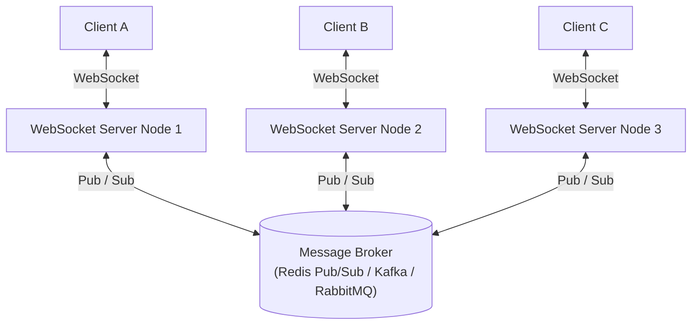

# ☕ Chai aur Code — Real-Time Communication Master Notes

> **Source Video:** [Long polling, server sent Events and Web Sockets | Real time communication jargons in Hindi](https://youtu.be/_CCyMWSZNU4)  
> **Channel:** [Chai aur Code](https://www.youtube.com/@chaiaurcode) | **Instructor:** Hitesh Choudhary

---

## 📌 Executive Summary & Industry Reality

When developers think of **Real-Time Communication (RTC)**, the first thought is usually building a **Chat App**. 

However, in industry, the **#1 real-world use case** is **Real-Time Dashboards & Analytics**:
- **SaaS KPI Dashboards:** Live visitor counters, billing events, new user signups.
- **Financial & Crypto Ticker Platforms:** Live order books, live candles.
- **Competitive Coding Platforms (e.g., LeetCode):** Submission judging status updates.
- **Live Sports & Delivery Tracking:** Live scorecards, driver coordinate updates.

In these systems, users should never need to press the browser refresh button.

---

## 1. Long Polling (The Universal Fallback)

### Mental Model
Imagine asking the waiter: *"Please notify me the instant our table is ready."* The waiter holds your request and only answers once a table opens up.

```
Client ──(GET /poll)──▶ [ Server holds connection open ]
                               │ (New event occurs or 30s timeout)
Client ◀──(200 OK: Data)───────┘
Client ──(GET /poll)──▶ [ Immediately re-opens new request ]
```

### Why Long Polling is Still Heavily Used Today (Universal Compatibility)
1. **"Ram-Baan" Universal Compatibility:** It is standard REST/HTTP. Every browser, mobile runtime, embedded device, and archaic system supports it.
2. **Behind Strict Proxies & Firewalls:** Many corporate proxies, VPNs, and legacy enterprise firewalls block or drop non-HTTP protocols (like WebSocket handshakes with `Upgrade` headers). Long Polling traverses firewalls and proxies without issue.
3. **Rock-Solid Fallback:** Libraries like Socket.IO historically use Long Polling as their default initial connection and fallback if WebSocket upgrades fail.

### Trade-offs & Disadvantages:
- **Memory & Resource Overhead:** Holding thousands of open HTTP connections in memory on the server consumes threads and file descriptors.
- **Bandwidth Wastage:** If no data is available before the timeout, the connection closes with empty data and immediately reconnects, repeatedly sending HTTP header baggage.
- **Higher Latency:** Setting up recurring TCP/TLS handshakes after each response introduces latency compared to persistent sockets.

---

## 2. Server-Sent Events (SSE)

### Mental Model
Subscribing to an FM radio broadcast or newsletter: The server continuously streams updates down a persistent pipe, but the client only listens.

```
Client ──(GET /events [Accept: text/event-stream])──▶ Server
Client ◀──(200 OK [Content-Type: text/event-stream])── Server
Client ◀──(data: {"event": "price_update", "val": 102}) Server
Client ◀──(data: {"event": "price_update", "val": 104}) Server
```

### The 3 Critical Response Headers (Interview Gold):
1. `Content-Type: text/event-stream` — Tells the browser / client to treat incoming bytes as continuous event streams.
2. `Cache-Control: no-cache` — Prevents intermediary proxies and CDNs from caching historical event chunks.
3. `Connection: keep-alive` — Keeps the underlying HTTP/1.1 or HTTP/2 connection open.

### Key Strengths:
- **Lightweight:** Runs over existing HTTP without new protocol negotiation.
- **Native Browser Auto-Reconnect:** Modern browsers automatically attempt reconnects if the connection drops using `EventSource`.
- **Ideal for AI / LLM Streaming:** Used by modern generative AI platforms (e.g. ChatGPT token generation) to stream tokens token-by-token.

### Limitations:
- **Unidirectional:** Server $\rightarrow$ Client only. Client cannot send messages back through this stream.

---

## 3. WebSockets & The Distributed Scaling Challenge (Brokers: Redis / Kafka)

### Mental Model
A dedicated, full-duplex phone call between two parties over a single connection.

```
Client ──(HTTP GET / Upgrade: websocket)──▶ Server
Client ◀──(101 Switching Protocols)──────── Server
══════════════ Persistent Full-Duplex TCP Socket ══════════════
Client ───────(Binary / JSON Frame)───────▶ Server
Client ◀──────(Binary / JSON Frame)──────── Server
```

### The Production Scaling Bottleneck: Why Direct WebSockets Don't Scale Alone
A WebSocket connection is a **stateful TCP socket** bound to the memory of a **specific server instance**.

```
  [ Client A ]                [ Client B ]
       │                           │
       ▼ (Socket #1)               ▼ (Socket #2)
┌──────────────┐            ┌──────────────┐
│  Server #1   │            │  Server #2   │
└──────────────┘            └──────────────┘
       ▲                           ▲
       │                           │
       └───── ??? HOW TO TALK ??? ─┘
```

If **Client A** is connected to **Server #1** and **Client B** is connected to **Server #2**, Server #1 has no knowledge of Client B!

### The Solution: Message Brokers (Redis Pub/Sub & Apache Kafka)
To scale WebSockets across multiple nodes, we introduce a central **Message Broker**:



1. **Client A** sends a message to **Node 1**.
2. **Node 1** publishes the message to the **Message Broker** (e.g., Redis channel or Kafka topic).
3. The broker distributes the message to all subscriber nodes (**Node 2**, **Node 3**).
4. **Node 2** pushes the message down its local WebSocket connection to **Client B**.

### Redis vs. Kafka as Brokers:
- **Redis (Pub/Sub):** Ultra-fast, in-memory, ephemeral message broadcasting (ideal for chat apps and live status).
- **Apache Kafka:** Distributed, persistent commit log with guaranteed ordering and replayability (ideal for high-throughput event sourcing and analytics).

---

## 4. Master Architectural Summary

| Technique | Transport | Directionality | Proxy/Firewall Friendly | Server Memory & Connection State | Scale-Out Architecture |
| :--- | :--- | :--- | :--- | :--- | :--- |
| **Short Polling** | HTTP/1.1 | Pull (Client $\rightarrow$ Server) | ✅ 100% Friendly | Stateless | Standard Load Balancer |
| **Long Polling** | HTTP/1.1 | Pull/Push Hybrid | ✅ 100% Friendly | Stateful hold in memory | Sticky Sessions or DB polling |
| **SSE** | HTTP/1.1, HTTP/2 | Push (Server $\rightarrow$ Client) | ✅ High (HTTP-based) | Stateful stream | Standard HTTP Load Balancer |
| **WebSockets** | TCP (RFC 6455) | Full-Duplex ($\longleftrightarrow$) | ⚠️ Can be blocked by proxies | Stateful Socket in RAM | Requires **Redis / Kafka Broker** |
| **WebRTC** | UDP (SRTP/SCTP) | Peer-to-Peer | ⚠️ Needs STUN/TURN traversal | Minimal server media load | Signaling Server + TURN Cluster |
